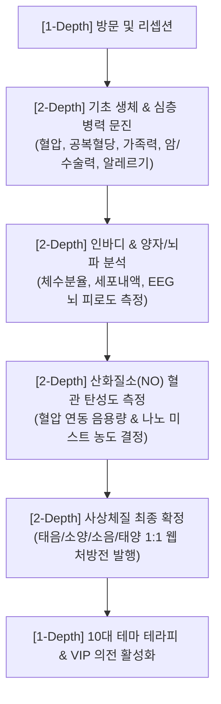
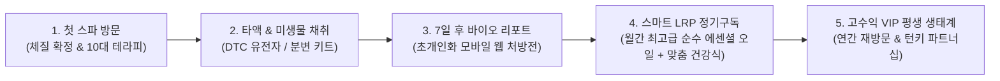

# 사상체질 기반 프리미엄 체질스파(Sasang SPA) 프로젝트 마스터 기획서

> **문서 버전**: v1.5.0 (2-Depth 세부 운영 스펙 및 로컬 근거 통합본)  
> **기획 기준일**: 2026-08-26  
> **총괄 기획 & 디렉터**: 유정근 (웰니스 총괄 / 📞 010-4728-9917 / ✉️ ryujean77@gmail.com)  
> **학술 & 의학 자문**: 임동구 박사 (식품공학박사 / Dr.Yim's 체질라이프스타일 연구소 소장 / 📞 010-2323-4662 / ✉️ ydoko@daum.net)  
> **기반 로컬 출처**: `I:\내 드라이브\2026체질스파` (체질스파 프로그램 기획 20260703, 유전자/마이크로바이옴, 에너지테라피 녹취록 및 기획서) & `E:\OneDrive\drop\01_체질라이프 전략기획`

---

## 1. 프로젝트 철학 및 글로벌 시장 배경 (Why Sasang SPA?)

### 1.1 글로벌 웰니스 시장(GWI 2026)의 대전환
* **7조 달러 글로벌 웰니스 경제**: 글로벌 웰니스 연구소(Global Wellness Institute, GWI) 데이터에 따르면, 글로벌 웰니스 시장은 연평균 8.6% 성장하여 2026년 7조 달러(약 9,500조 원) 규모에 도달했습니다.
* **스파 패러다임의 3단계 진화**:
  1. **1세대 (휴식형)**: 서양의 스웨디시 등 단순 근육 이완 마사지 (차별화 한계).
  2. **2세대 (시설/메디컬형)**: 고급 리조트 하드웨어 및 의료 시술 결합 (고비용/부작용 리스크).
  3. **3세대 (초개인화 처방형 웰니스, Prescriptive Wellness)**: **생체 데이터 기반 1:1 체질 맞춤 신체 리셋 (현재 글로벌 VIP가 열광하는 시장).**

### 1.2 K-Wellness의 독창성 (Originality)
* **인도 아유르베다(Ayurveda) 대비 비교 우위**: 아유르베다가 바타·피타·카파 3도샤에 기반한 체질 분류라면, 사상체질 의학은 인간의 **장부대소(臟腑大小, 간·폐·비·신)** 장기 용량과 생리적 편차를 명확한 해부생리학적 균형점으로 해석하는 한국 고유의 완성된 의학 체계입니다.
* **한국 고유의 심신 치유 기법 결합**: 서양의 단순 오일 마사지를 넘어, 한국 전통의 동적 명상 기체조인 **태극선법(Taeguk Sun-beop)**과 한국 사찰/선도(仙道)의 **고요 침묵 명상**을 융합합니다.

### 1.3 부작용 0%의 초개인화 안전성 (Safety & Precision)
* **'모두에게 좋은 것'의 치명적 함정 배제**: 일반 스파에서는 널리 쓰이는 라벤더나 페퍼민트 오일, 온열 사우나가 특정 체질(소음인의 냉증이나 소양인의 상열감)에 치명적인 두통, 어지럼증, 피부 발진을 일으킬 수 있습니다.
* **최고급 100% 순수 에센셜 오일 체질 매칭**: 순도 100% 테라피 등급 오일을 체질별로 엄격히 선별 도포하여 알레르기 및 부작용을 사전에 원천 차단합니다.

### 1.1 K-Wellness의 독창성 (Originality)
* **인도 아유르베다(Ayurveda) 대비 비교 우위**: 아유르베다가 바타·피타·카파 3도샤에 기반한 체질 분류라면, 사상체질 의학은 인간의 **장부대소(臟腑大小, 간·폐·비·신)** 장기 용량과 생리적 편차를 명확한 해부생리학적 균형점으로 해석하는 한국 고유의 완성된 의학 체계입니다.
* **한국 고유의 심신 치유 기법 결합**: 서양의 단순 오일 마사지를 넘어, 한국 전통의 동적 명상 기체조인 **태극선법(Taeguk Sun-beop)**과 한국 사찰/선도(仙道)의 **고요 침묵 명상**을 융합합니다.

### 1.2 부작용 0%의 초개인화 안전성 (Safety & Precision)
* **'모두에게 좋은 것'의 치명적 함정 배제**: 일반 스파에서는 널리 쓰이는 라벤더나 페퍼민트 오일, 온열 사우나가 특정 체질(소음인의 냉증이나 소양인의 상열감)에 치명적인 두통, 어지럼증, 피부 발진을 일으킬 수 있습니다.
* **100% 최고급 100% 순수 에센셜 오일 체질 매칭**: 순도 100% 테라피 등급 오일을 체질별로 엄격히 선별 도포하여 알레르기 및 부작용을 사전에 원천 차단합니다.

### 1.3 데이터 기반의 즉각적 신체 리셋 (Scientific Efficiency)
* 주관적 힐링에 그치지 않고, **인바디(체수분/근육량), 양자 분석(장부 에너지), 뇌파(EEG 스트레스 지수), 산화질소(NO) 수치**를 측정하여 체류 전후의 생체 지표 개선을 수치로 증명합니다.

---


---

## 2. 우리가 해결하는 현대인의 3대 고질적 문제 & 근본 해결 원리 (Problem & Solution)

### 2.1 기존 일반 스파 및 웰니스의 3대 치명적 한계 (The Problem)

1. **문제 1: 획일적 처방으로 인한 부작용 ('One-Size-Fits-All' Risk)**
   * **현실**: 기존 스파는 "누구에게나 좋은 것"이라는 잘못된 전제로 라벤더, 페퍼민트 오일이나 고온 사우나를 무분별하게 적용합니다.
   * **치명적 위험**: 상체에 열이 많은 소양인에게 뜨거운 사우나나 진저/시나몬 오일을 쓰면 두통·안구충혈·불면증이 악화되고, 몸이 차고 비위가 약한 소음인에게 찬 탄산스파나 페퍼민트를 쓰면 극심한 수족냉증과 복통이 유발됩니다.

2. **문제 2: 일시적 이완 후 다음 날 원상복귀 (Temporary Relief vs Root Cause)**
   * **현실**: 단순 오일 마사지는 피부와 표층 근육만 일시적으로 만져줄 뿐, 체내 장부의 대사 불균형(간·폐·비·신의 장부대소 편차)과 만성 독소 정체를 해결하지 못합니다.
   * **한계**: 스파를 받은 당일 밤만 잠시 편안할 뿐, 다음 날 아침이면 만성 피로와 뻐근함이 100% 원상복귀되는 '밑 빠진 독에 물 붓기'식 악순환이 반복됩니다.

3. **문제 3: 무분별한 유행성 디톡스·식이요법의 역효과 (Blind Detox)**
   * **현실**: 체질을 무시한 유행성 디톡스 주스(케일/오이 등 찬 성질)나 무작정 굶는 단식은 소화기 장부를 심각하게 훼손합니다.
   * **피해**: 비위가 차고 약한 소음인에게 찬 녹즙은 위장 마비를 일으키고, 고단백 육류 과다는 태양인의 간 해독력을 파괴합니다.

---

### 2.2 사상체질 스파가 제시하는 3대 근본 해결책 (Our Unique Solutions)

1. **해결 1: 장부대소(臟腑大小)에 기반한 0% 부작용 초개인화 처방**
   * 1894년 이제마 『동의수세보원』의 해부생리학과 생체 데이터를 결합하여 간·폐·비·신의 장부 용량을 정밀 진단합니다.
   * 오직 내 몸의 장부 편차에만 유효한 **최고급 100% 순수 에센셜 오일과 맞춤 수온(41℃ 온열탕 vs 38.5℃ 쿨링탕)**을 처방하여 부작용을 원천 차단합니다.

2. **해결 2: 3중 융합 신체 리셋 (스파 외용 + 12h 단식 섭생 + 비언어 의전)**
   * **외용 스파**: 80분 이원화 바디 테라피(한의 수기 지압 + 순수 오일 림프 드레나쥐)로 전신 기혈 순환로를 개방.
   * **내복 섭생**: 저녁 18:00부터 익일 06:00까지 **12시간 단식(자가포식, Autophagy)**으로 손상된 세포 찌꺼기를 청소하고, 기상 직후 **4대 체질 맞춤 영양 미역국 조식**으로 장부를 완벽하게 영양 재건.
   * **비언어 의전**: 스태프가 고객의 손가락 **은반지(Eun-banji)와 컬러 가운**만 보고 음수/온도/향기를 100% 맞춤 제공.

3. **해결 3: 평생 지속 가능한 바이오 LTV 라이프스타일 (DTC 유전자 / 마이크로바이옴 / LRP 구독)**
   * 1회성 스파 방문을 넘어 DTC 유전자 분석 및 장내 미생물(마이크로바이옴) 키트를 연동하여 7일 후 1:1 모바일 바이오 리포트를 발행합니다.
   * 일상 복귀 후에도 모바일 웹 처방전과 **월간 맞춤 오일 정기구독(LRP)**을 통해 체질 섭생을 평생 습관화하여 만성 불균형 재발을 완벽히 차단합니다.

---

### 2.3 체질별 4대 고질적 병리 문제 & 1:1 맞춤 해결 매칭 매트릭스

| 체질 구분 | 타고난 장부 편차 | 현대인의 고질적 병리 문제 (Pain Points) | 사상체질 스파의 근본 해결 솔루션 (Solutions) |
| :--- | :--- | :--- | :--- |
| **태음인** | **간대폐소** (간강/폐약) | • 폐·호흡기 건조 및 심부 림프 노폐물 정체<br>• 비만 및 심혈관 대사 저하, 부종 | • 디톡스 림프 배농 & 에어 스팀 스파<br>• 유칼립투스/샌달우드 오일 + 오미자차<br>• **소고기 양지 들깨 미역국 + 우측 4지 은반지** |
| **소양인** | **비대신소** (비열/신약) | • 상체 열감, 편두통, 가슴 답답함, 불면증<br>• 신장 음기 고갈 및 급격한 감정 기복 | • 38.5℃ 쿨링 하이드로 탄산 스파<br>• 페퍼민트/라벤더 뇌파 진정 + 구기자차<br>• **돼지고기 수육 / 조개 미역국 + 좌측 2지 은반지** |
| **소음인** | **신대비소** (신강/비약) | • 수족냉증, 위장 냉증, 만성 소화불량<br>• 자율신경계 과민 및 만성 무기력/피로 | • 41℃ 한방 온열 족욕 + 42~45℃ 1시간 온열 챔버(체온 1℃ 상승)<br>• 온가드/진저/시나몬 + 대추계피차<br>• **닭가슴살 황기 보양 미역국 + 우측 3지 은반지** |
| **태양인** | **폐대간소** (폐강/간약) | • 기운 상기(上氣), 목덜미 강직, 잦은 분노<br>• 간 해독력 저하 및 하체 무력감 | • 단전 호흡 태극선법 기체조 (그라운딩)<br>• 베티버/프랑킨센스 + 모과솔잎차<br>• **완도산 전복 홍합 해물 미역국 + 좌측 4지 은반지** |

## 3. [1-Depth & 2-Depth] 데이터 기반 정밀 진단 시스템



### [2-Depth 세부 진단 프로토콜]
1. **STEP 01. 기초 문진**: 혈압, 공복 혈당, 심혈관/암 가족력, 주요 수술 이력(자궁 적출, 담낭 절제 등), 개인별 알레르기 인자 기록.
2. **STEP 02. 생체 데이터 측정**: 
   - 체수분 균형 및 부종 지수 (InBody 770 수준)
   - 양자 공명 장부 에너지 활성도 분석
   - 뇌파(EEG) 및 심박변이도(HRV) 스트레스·자율신경 밸런스 분석
3. **STEP 03. 산화질소(NO) 관리**: 혈관 탄력도와 혈압 상태를 반영하여 산화질소수 음용량(1일 1.5L 기준 저혈압 고객 감량 처방) 및 나노 미스트 농도 결정.
4. **STEP 04. 사상체질 확정**: 4대 장부 대소 편차 확정 후 1:1 맞춤 모바일 처방전 발행 및 VIP 비언어 의전 링(은반지)/의복 색상 세팅.

---

## 3. [1-Depth & 2-Depth] 10대 시그니처 테마 테라피 상세 스펙

| 1-Depth 테마명 | 영문명 | 2-Depth 세부 실행 프로토콜 & 로컬 기획 근거 | 처방 기준 & 주요 사용 재료 |
| :--- | :--- | :--- | :--- |
| **01. 웰컴 서비스** | Welcome Orientation | 프라이빗 다실 1:1 오리엔테이션, 체질별 맞춤 온도의 웰컴 티 시음 및 문진표 확인 (15분) | 소음인(대추계피 38℃), 소양인(구기자산수유 상온), 태음인(오미자), 태양인(모과) |
| **02. 족욕 테라피** | Foot Bath Therapy | 본 테라피 전 신체 하부 온도 상승 및 두한족열(頭寒足熱) 유도 (20분). 최고급 순수 에센셜 오일 2방울 투입 | 소음/태음(40~42℃ 한방 당귀/천궁/생강), 소양/태양(38~39℃ 박하/결명자/모과) |
| **03. 에너지 테라피** | Nonverbal Energy Care | 체질별 컬러 의복 착용 및 **은반지(Eun-banji)·체질 팔찌** 착용을 통한 스태프 무언(Nonverbal) 맞춤 서빙 | 은반지 손가락 경락 배정, 컬러 가운(황-태음, 청-소양, 백-소음, 적-태양) |
| **04. 푸드 테라피** | 12h Fasting & Custom Soup | **18:00~익일 06:00 12시간 단식**으로 장 해독, 기상 직후 아로마 주스 및 **4대 체질 맞춤 미역국** 공급 | 태음(소고기양지들깨), 소양(돼지고기수육/조개), 소음(닭가슴살황기), 태양(전복홍합) |
| **05. 바디 테라피** | Meridian & CPTG Body | **이원화 테라피**: 1단계 한의 수기 지압(30분) + 2단계 최고급 100% 순수 에센셜 오일 림프 드레나쥐(50분) | FCO 코코넛 오일 10:1 안전 희석, 체질별 타깃 오일(유칼립투스/페퍼민트/온가드/베티버) |
| **06. 티 테라피 & 명상** | Tea Ceremony & Meditation | 최고급 전통 도자기 다기 우림 시연 및 **30분 침묵 티 명상** (전자기기 100% 차단) | 다도 마스터 1:1 시연, 호흡 일치 및 뇌파 알파(α)파 유도 |
| **07. 수(水) 테라피** | Nitric Oxide (NO) Water | 고농도 **산화질소수(NO Water)** 세포 수화 및 전신 고압 **나노 미스트 챔버** 입실 (15분) | 혈관 내피세포 탄력 강화, 저혈압 고객 수동 조절 안전 가이드라인 적용 |
| **08. 온열 테라피** | 1-Hour Deep Thermal | 체질 맞춤 온열 에센셜 오일 척추 도포 후 **1시간 심부 온열 챔버(42~45℃) 입실, 체온 1℃ 상승 유지** | 심부 체온 1℃ 상승 시 면역력 5배 증대, 원적외선 세라믹 매트 활용 |
| **09. 전통 기체조** | Taeguk Sun-beop | 서양 필라테스를 배제하고 기(氣)의 흐름을 체득하는 **한국 고유 태극선법 8초식 동적 기체조** (40분) | 단전 호흡, 탁기(濁氣) 배출, 장부 경락 활성화 |
| **10. 멘탈 관리** | Korean Mindful Meditation | 서양식 싱잉볼을 지양하고 **한국 전통 사찰 및 선도(仙道) 고요 침묵 명상** 적용 (40분) | 뇌 피로도 70% 감소, 정서적 안정 및 자율신경계 회복 |

---

## 4. [1-Depth & 2-Depth] 4대 사상체질별 처방 매트릭스

```
┌─────────────────────────────────────────────────────────────────────────────┐
│ 4대 사상체질별 장부대소 및 처방 매트릭스                                    │
├───────────────┬─────────────────────┬───────────────────┬───────────────────┤
│ 체질 구분     │ 장부 대소 (臟腑大小)│ 추천 스파 코스    │ 최고급 순수 에센셜 오일 & 식단  │
├───────────────┼─────────────────────┼───────────────────┼───────────────────┤
│ 태음인 (Tae-eum)│ 간대폐소 (간강/폐약)│ 디톡스 림프 배농  │ 유칼립투스/오미자차/│
│               │                     │ 에어클린 스팀 스파│ 소고기 들깨 미역국│
├───────────────┼─────────────────────┼───────────────────┼───────────────────┤
│ 소양인 (So-yang)│ 비대신소 (비열/신약)│ 쿨링 하이드로     │ 페퍼민트/구기자차/ │
│               │                     │ 탄산 진정 스파    │ 돼지고기 조개 미역│
├───────────────┼─────────────────────┼───────────────────┼───────────────────┤
│ 소음인 (So-eum) │ 신대비소 (신강/비약)│ 온열 스톤 테라피  │ 온가드·진저/대추차 │
│               │                     │ 코어 웜업 서멀    │ 닭가슴살 황기 미역│
├───────────────┼─────────────────────┼───────────────────┼───────────────────┤
│ 태양인 (Tae-yang)│ 폐대간소 (폐강/간약)│ 그라운딩 플로팅   │ 베티버/모과차/    │
│               │                     │ 하체 밸런싱 스파  │ 전복 홍합 해물국  │
└───────────────┴─────────────────────┴───────────────────┴───────────────────┘
```

---

## 5. [1-Depth & 2-Depth] 4대 VIP 체류 프로그램 운영 타임테이블

### 5.1 [2박 3일 단기 리프레시 코스] (Short-Term Refresh)
* **목표**: 급성 스트레스 해소, 상열하한 교정, 숙면 유도
* **2-Depth 타임테이블**:
  - **Day 1**: 14:00 체크인 & 사상체질 확정 ➔ 16:00 20분 약재 족욕 + 80분 이원화 바디 테라피 ➔ 18:00 단식 시작 & 30분 티 명상
  - **Day 2**: 07:30 체질 맞춤 미역국 ➔ 09:30 40분 태극선법 기체조 ➔ 14:00 1시간 심부 온열 테라피 ➔ 16:30 산화질소수 나노 미스트 ➔ 18:00 단식
  - **Day 3**: 08:00 아로마 주스 & 체질 조식 ➔ 09:30 사후 생체 지표 측정 ➔ 11:00 1:1 홈케어 키트 처방 및 체크아웃

### 5.2 [5박 6일 중기 디톡스 코스] (Deep Detox & Align)
* **목표**: 심부 독소 배출, 만성 부종 개선, 장내 환경 정화
* **2-Depth 핵심 프로토콜**:
  - 1~3일차: 폐경락 림프 배농 + 매일 1시간 심부 온열 챔버 + 산화질소수 1.5L 세포 수화
  - 4~6일차: 장내 미생물(마이크로바이옴) 키트 검사 + 태극선법 심신 호흡 + 30분 티 침묵 명상 + 섭생 정착 코칭

### 5.3 [15박 16일 장기 리셋 코스] (Total Body Reset)
* **목표**: 장부 대소 편차 교정, 체질 섭생 습관화, 면역 나이 5년 리셋
* **2-Depth 핵심 프로토콜**:
  - DTC 유전자 분석을 통한 취약 유전자군 확인
  - 10대 시그니처 테라피 매일 3단계 순환 처방
  - 1:1 전담 라이프스타일 매뉴얼북 발행 및 1년 VIP 스마트 CRM 등록

### 5.4 [1개월 특수 집중 케어 코스] (Cellular Regeneration)
* **목표**: 병후 회복기 면역력 재건, 세포 수준 전면 재생
* **2-Depth 핵심 프로토콜**:
  - 저온 무자극 한방 약재 족욕 (37.5℃) + 프랑킨센스 세포 진정 아로마 터치
  - 저압 온열 챔버 + 100% 체질 맞춤 고단백 유동식
  - NK세포 활성도 증대 및 전담 간호/테라피 버틀러 1:1 밀착 의전

---

## 6. 첨단 바이오 연계 VIP 평생 LTV 모델



---

## 7. 호텔 및 리조트 턴키(Turn-Key) 제안 스펙

1. **공간 인프라 컨설팅**: 리셉션, 진단실, 프라이빗 스파 스위트, 1시간 온열 챔버실, 다도 명상실 표준 설계.
2. **테라피스트 마스터 아카데미**: 사상체질 장부대소 이론, 최고급 순수 에센셜 오일 처방, 은반지 비언어 의전 80시간 공식 이수.
3. **스마트 CRM 시스템**: 고객별 체질 데이터 누적, 모바일 처방전 자동 발행, LRP 구독 관리.

---

## 8. 프로젝트 공식 문의 및 파트너십 연락처

* **총괄 기획 / 비즈니스 디렉터**: **유정근**
  - 📞 **전화번호**: `010-4728-9917`
  - ✉️ **이메일**: `ryujean77@gmail.com`
  - 💼 **역할**: 스파 비즈니스 총괄, 최고급 순수 에센셜 오일테라피 처방, 1:1 VIP 케어 및 호텔/리조트 턴키 컨설팅

* **사상체질 의학 / 식품공학 / 학술 총괄**: **임동구 박사**
  - 🎓 **학위 / 소속**: 식품공학박사 · Dr.Yim's 체질라이프스타일 연구소 소장
  - 📞 **전화번호**: `010-2323-4662`
  - ✉️ **이메일**: `ydoko@daum.net`
  - 💼 **역할**: 사상체질 맞춤 식품공학 섭생학, 체질라이프스타일 진단 프로토콜, 의학/학술 자문 및 B2B 특강