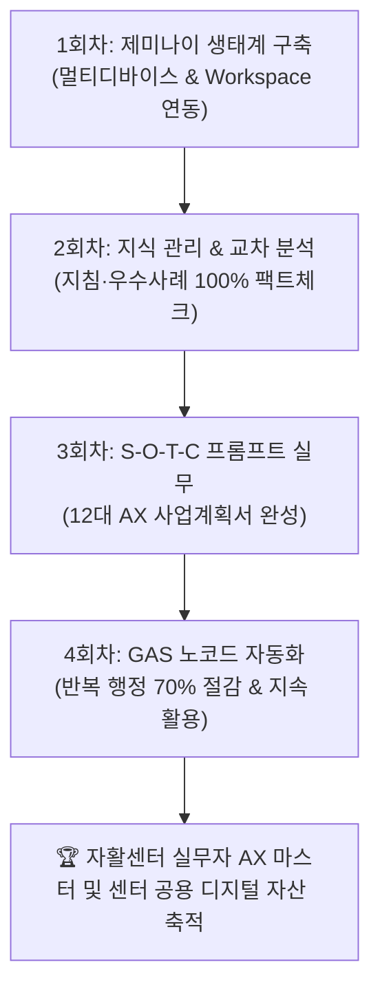

# 📋 [강의계획서] 인천광역자활센터 생성형 AI 실무 마스터과정

---

## 1. 기본 정보 (Course Overview)

| 항목 | 내용 |
| :--- | :--- |
| **기관명** | **인천광역자활센터** |
| **과정명** | **인천광역자활센터 실무자를 위한 생성형 AI 실무 마스터과정 (1~4회차 집중 완성)** |
| **강사명 (소속)** | **유정근** (광진사회적경제네트워크 / EGLS Lab 대표) |
| **교육 일정** | **2026년 9월 15일(화) ~ 9월 16일(수)** (총 2일간 8시간 / 14:00 ~ 18:00) *(예비 일정: 2026.09.14~09.15 또는 2026.09.21~09.22)* |
| **교육 대상** | **인천광역자활센터 및 인천지역 11개 지역자활센터 임직원 및 실무자** |
| **교육 형태** | 이론 및 개념(10%) + **실기 실습 및 현장 코칭(90%)** *(실습 중심 워크숍)* |
| **준비물 / 기자재** | • **강사용/교육장**: 빔프로젝터, 무선 마이크, 유무선 인터넷(Wi-Fi), 강사 노트북 • **수강생**: 개인 노트북(PC), 스마트폰, 구글 계정(Gemini, NotebookLM 등) |

---

## 2. 교육 목표 (Learning Objectives)

1. **구글 제미나이(Gemini) 생태계 완전 정복**:
   - 모바일-데스크톱 멀티 디바이스 동기화, Docs/Drive 워크스페이스 연동 및 최신 AI 모델(Gemini 2.5/3.0/3.7)의 실무 선택 전략을 체득합니다.
2. **지능형 다중 문서 지식베이스 구축 (Gemini Notebooks / NotebookLM)**:
   - 복잡한 자활사업 지침서, 3개년 우수사례집, 성과평가지표를 소스로 주입하여 100% 근거 기반 팩트체크 및 교차 분석(Cross-Check) 역량을 확보합니다.
3. **자활 행정 실무형 프롬프트 엔지니어링 (S-O-T-C 프레임워크)**:
   - 문장 작성의 고민 없이 표준 템플릿에 따라 공문서, 기안문, 사업계획서, 프로포절을 고품질로 즉시 생성하는 능력을 완성합니다.
4. **자활 10대 문서 맞춤형 AI 비서(Gems) 및 GAS 노코드 자동화**:
   - 반복적인 상담일지 작성, 회의록 요약, 일정 알림 및 데이터 정리를 자동화하는 봇을 구축하여 실제 업무 시간을 70% 이상 절감합니다.

---

## 3. 회차별 세부 강의 계획 (Detailed Curriculum)

### 📅 **[1일차] 2026년 9월 15일(화) 14:00 ~ 18:00 (4시간)**

| 회차/시간 | 강의 모듈 및 주제 | 세부 교육 내용 및 실습 산출물 |
| :---: | :--- | :--- |
| **1회차** (14:00~15:50 / 2시간) | **제미나이(Gemini) 생태계 완전 정복 & 업무 적용** *(Gemini Ecosystem & Workspace)* | • **1-1. 모바일 앱 ↔ 데스크톱 실시간 동기화**: 현장 이동 중 모바일 음성 메모와 사무실 PC 작업의 완벽한 연속성 확보 • **1-2. Docs 내보내기 서식 유지 워크플로우**: AI 생성 결과를 결재용 문서 서식으로 깔끔하게 원클릭 내보내기 • **1-3. 구글 워크스페이스 익스텐션 연동**: `@Gmail`, `@Drive`를 활용해 메일 및 드라이브 내 문서를 즉시 검색·요약·답장 초안 작성 • **1-4. 모바일 라이브(Live) 음성 대화 & 비전(Vision) 처리**: 현장 참여자 면담 음성 실시간 요약, 영수증/서식 사진 OCR 텍스트 자동 추출 • **1-5. 모델 선택 전략 & 자활 10대 문서 Gems 기초**: Gemini 2.5 Flash / 3.0 Pro 최적 활용법 및 나만의 전용 비서(Gems) 설계 |
| **15:50~16:10** | **중간 휴식 및 개별 환경 점검 (20분)** | 질의응답 및 수강생 구글 계정/디바이스 세팅 개별 지원 |
| **2회차** (16:10~18:00 / 2시간) | **Gemini Notebooks 지식 관리 & 다중 문서 교차 분석** *(NotebookLM Knowledge System & Deep Cross-Check)* | • **2-1. NotebookLM 인터페이스 및 기초 환경설정**: 자활사업 안내 지침(PDF) 및 법령 데이터 주입 체계화 • **2-2. 딥리서치(Deep Research) & 소스 관리**: 보건복지부 지침, 우수사례집, 평가지표 다중 업로드 및 필터링 • **2-3. 다중 문서 교차 분석(Cross-Check) 실습**: 3개년 우수사례와 평가지표를 교차 검증하여 신규 사업 아이디어 및 보완점 도출 • **2-4. 근거 기반 팩트체크 & 원천 인용(Citation) 검증**: 환각(Hallucination) 0%의 신뢰성 높은 보고서 작성법 • **2-5. 멀티미디어 아티팩트 생성**: 오디오 브리핑(Audio Overview) 생성, 복합 데이터 비교표 일괄 추출 및 AI Studio 연동 |

---

### 📅 **[2일차] 2026년 9월 16일(수) 14:00 ~ 18:00 (4시간)**

| 회차/시간 | 강의 모듈 및 주제 | 세부 교육 내용 및 실습 산출물 |
| :---: | :--- | :--- |
| **3회차** (14:00~15:50 / 2시간) | **프롬프트 엔지니어링 × 자활 실무 완벽 적용** *(Prompt Engineering & AX Business Plans)* | • **3-1. 데이터 처리 파이프라인 7단계 최적화**: 원시 데이터 수집부터 최종 결재 문서까지의 체계적 흐름 구축 • **3-2. CoT(Chain of Thought) & Few-shot 구조화**: 단계별 논리 추론 프롬프트 및 예시 기반 정밀 출력 기법 • **3-3. 자활 행정 실무형 S-O-T-C 공식 완벽 해부**: 상황(Situation)-목표(Objective)-작업(Task)-조건(Constraint) 4단계 프레임워크 적용 • **3-4. 마인드맵 & 시각화 다이어그램(Mermaid) 출력**: 사업 추진 체계도, 공정 흐름도, 조직도 텍스트 기반 시각화 • **3-5. 자활센터 AX 진단 사업계획서 12종 실습**: 생산·영업관리, 참여자 상담, 자활기업 창업, 보조금 정산 등 12개 실무 영역 사업계획서 생성 |
| **15:50~16:10** | **중간 휴식 및 실습 데이터 정리 (20분)** | 실습 산출물 공유 및 질의응답 |
| **4회차** (16:10~18:00 / 2시간) | **GAS(Google Apps Script) 노코드 자동화 & 지속관리** *(GAS No-Code Automation & Sustainable Operations)* | • **4-1. GAS 기초 개념 및 노코드 에디터 진입**: 코딩 없이 구글 앱스 스크립트로 업무를 자동화하는 원리 이해 • **4-2. Google Docs 문서 자동 생성 봇**: 참여자 정보 및 상담 메모 입력 시 표준 상담일지/결과보고서 자동 생성 • **4-3. Google Calendar 기한 알림 봇**: 사업비 정산일, 운영위원회 일정, 실적 마감일 자동 캘린더 등록 및 알림 • **4-4. 보안 클라우드 코드 실행 & 엑셀 데이터 분석**: 대용량 매출/참여자 엑셀 데이터를 안전하게 분석하고 차트 도출 • **4-5. Gmail 일괄 발송 봇 & 자활 게이트웨이 템플릿**: 맞춤형 공지 메일 자동 일괄 발송 및 센터 단위 디지털 자산화 로드맵 수립 |

---

## 4. 교육 기대효과 및 지속 사후관리 (Expected Outcomes)

1. **실무 즉시 적용 가능한 10대 문서 Gem & 템플릿 자산화**:
   - 교육 중 실습한 맞춤형 Gem 챗봇(사업계획서, 프로포절, 성과평가서 등)과 프롬프트 템플릿이 수강생 개인 및 센터의 자산으로 즉시 귀속됩니다.
2. **문서 작성 시간 70% 단축을 통한 핵심 복지 서비스 집중**:
   - 단순 반복 문서 작업 시간을 획기적으로 줄여 자활 근로 참여자 1:1 심층 상담 및 신규 일자리 발굴 등 본연의 핵심 가치에 집중할 수 있습니다.
3. **지속 가능한 교육 리소스 영구 제공**:
   - [인천자활 AI 교육 공식 웹 교안 포털](https://ryujean77.github.io/ryujean-slides/)을 통해 1~4회차 고해상도 슬라이드, 복사용 프롬프트 코드블록, 실습 예제 파일을 영구적으로 열람 및 복습할 수 있습니다.

---
**작성일**: 2026년 8월 29일  
**작성자**: 유 정 근 강사 (광진사회적경제네트워크 / EGLS Lab 대표)  
**제출처**: 인천광역자활센터 귀하
