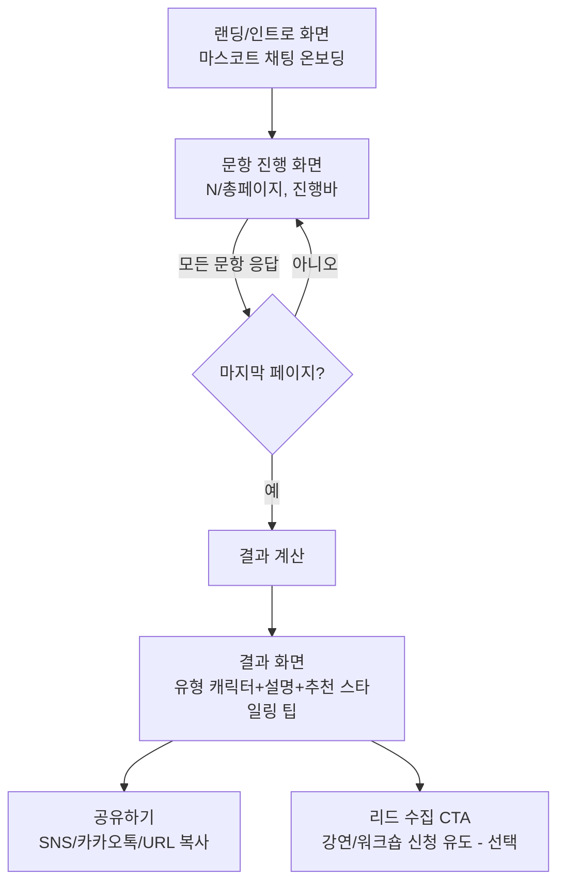

# 패션테라피진흥원 심리테스트 앱 개발지시서

- **문서 버전**: v1.0
- **작성일**: 2026-08-21
- **참조 벤치마크**: https://itcolor.kr/innertest ("INNER COLOR" 컬러성향테스트)
- **발주처(가정)**: 패션테라피진흥원
- **연계 자료**: `산출물/20260821_0205_임동구_남미화_패션테라피인문학_일러스트에디션/` (사상체질 × 패션테라피 인문학 강연 제안서)

---

## 1. 배경 및 목적

패션테라피진흥원은 기존 강연 사업(임동구 박사 — 사상체질 / 남미화 박사 — 패션테라피 인문학)의 핵심 메시지인
**"내면의 기질(사상체질)을 알고, 외면의 색채·스타일(패션테라피)로 자존감을 회복한다"**는 컨셉을,
누구나 쉽게 접근할 수 있는 **웹 심리테스트**로 만들어 다음 목적을 달성한다.

1. **잠재 고객 유입/리드 확보**: 재미있는 심리테스트로 방문 유도 → 강연/워크숍 리드로 전환
2. **브랜드 인지 확산**: SNS 공유가 잘 되는 결과 카드 제공
3. **강연 콘텐츠의 디지털 자산화**: 강연에서 쓰는 유형 분류 체계를 온라인 진단 도구로 재사용

벤치마크인 잇컬러의 "INNER COLOR" 테스트는 완성도 높은 예시이나, **캐릭터 디자인은 잇컬러 사가 저작권 등록을 완료한 자산**이므로
(사이트 하단 "9종 캐릭터 저작권 등록 완료 | 무단 복제·배포·가공·상업적 이용 금지" 명시) **그대로 모사하지 않는다.**
본 지시서는 **UX 구조와 인터랙션 패턴만 참고**하고, 비주얼·캐릭터·문항·유형 체계는 패션테라피진흥원 고유 자산으로 새로 설계하는 것을 원칙으로 한다.

---

## 2. 벤치마크 분석 (itcolor INNER COLOR)

실제 앱을 캡처하여 분석한 화면 흐름은 다음과 같다.

| 구간 | 내용 |
|---|---|
| **인트로(온보딩)** | 마스코트 캐릭터("Nobody")가 말풍선(채팅 UI) 4~5개로 테스트 취지를 설명 → 하단 `START` 버튼 |
| **문항 진행** | 총 24페이지, 페이지당 3문항 = **총 72문항**, 전부 `예 / 아니오` 2지선다 |
| **진행률 표시** | 상단에 "N / 24" 페이지 카운터 + 결과 유형 9종 캐릭터 아이콘을 가로로 나열, 진행된 만큼 아이콘 아래 점선 바가 채워짐(예측 애니메이션형 프로그레스) |
| **네비게이션** | 카드 하단 좌우 화살표(◀ ▶)로 페이지 이동, 모든 문항 응답 전 다음 이동 시 "모든 문항에 답해주시기 바랍니다" 경고 노출 |
| **결과 유형 개수** | 9종 (아이콘 형태로 미리 노출: 불꽃/별/솜뭉치/식물/버섯/토끼유령/구름/곰돌이/수정 등 몬스터 캐릭터) |
| **UI 톤** | 파스텔 베이지 배경 + 원색 포인트(그린/옐로/오렌지/블루) 카드 테두리(페이지마다 테두리색 변경), 라운드 캡슐 버튼, 선택된 버튼은 블랙+화이트 아웃라인으로 강조 |
| **저작권 고지** | 화면 최하단 고정 "© 2026 ITCOLOR. All rights reserved. / 9종 캐릭터 저작권 등록 완료…" |

**참고할 UX 패턴 (구조적으로 차용 가능)**
- 챗봇 캐릭터가 말을 거는 도입부 → 몰입도 상승
- 결과 유형 아이콘을 문항 진행 중에도 미리 노출해 "내가 어떤 유형이 될까" 궁금증 유발
- 페이지당 다문항 배치로 전체 문항 수 대비 체감 페이지 수 감소(72문항이지만 24스텝으로 느껴짐)
- 테두리 색상을 페이지마다 바꿔 지루함 방지

---

## 3. 패션테라피진흥원 버전 기획

### 3.1 가칭
**"패션 이너 테라피" / "FASHION INNER TYPE"** (최종 네이밍은 발주처 확정 필요 → 확인 필요 사항 §9 참조)

### 3.2 진단 축 설계 (제안)
기존 강연 자산인 **사상체질(태양인/태음인/소양인/소음인)** 과 **패션테라피 스타일 성향**을 결합한 2단계 또는 매트릭스 구조를 제안한다.

- **옵션 A (심플형, 권장 — 벤치마크와 동일 구조)**: 문항 응답 누적 점수로 **4~9종 "패션 자존감 유형"** 중 하나를 도출 (예: 사상체질 4유형 × 표현강도 2단계 = 8유형, 또는 색채심리 기반 독자 유형 9종)
- **옵션 B (2축 매트릭스형)**: X축(내향-외향 에너지) × Y축(안정-변화 추구)로 4분면 유형 도출 후, 각 분면에 사상체질 캐릭터 매칭
- **최종 유형 수, 유형명, 유형별 캐릭터/색채/카피는 남미화 박사(패션테라피 인문학) 자문 하에 확정** — 본 지시서에서는 확인 필요 사항으로 남김

### 3.3 문항 설계 원칙
- 벤치마크와 동일하게 **예/아니오 이분형 리커트 간소화 문항** 채택 (응답 속도 ↑, 이탈률 ↓)
- 문항 수는 **최소 24문항(8페이지×3) ~ 최대 48문항(16페이지×3)** 권장 — 72문항은 모바일 이탈률 우려, 벤치마크보다 축소
- 문항 카테고리(예시, 확정 필요):
  1. 색채 선호 (예: "화려한 색보다 무채색이 편하다")
  2. 스타일 표현 욕구 (예: "옷으로 그날 기분을 표현하는 편이다")
  3. 대인관계 에너지 (사상체질 기질 반영, 예: "가까운 사람 일에 내 일처럼 마음이 쓰인다" — 벤치마크 문항 패턴)
  4. 의사결정 성향 (즉흥 vs 계획)
  5. 자존감/자기표현 (패션테라피 핵심 — "옷을 잘 입으면 자신감이 올라간다" 류)

---

## 4. 정보구조 (IA) & 화면 흐름



### 4.1 화면별 상세 스펙

**① 인트로 화면**
- 로고/타이틀
- 마스코트 캐릭터 + 채팅 말풍선 3~5개 (패션테라피 톤앤매너로 재작성, "Nobody" 그대로 사용 금지)
- `START` 버튼 (탭 시 문항 화면으로 전환, 페이드/슬라이드 트랜지션)

**② 문항 진행 화면**
- 상단: 앱 타이틀 + "N / 총 페이지" 카운터
- 그 아래: 결과 유형 캐릭터 아이콘 가로 스크롤/나열 + 진행 점선바(현재 페이지 비율만큼 채움)
- 문항 리스트: 페이지당 2~3문항, 각 문항에 `예`/`아니오` 캡슐 버튼 2개
  - 선택 시 버튼 스타일 즉시 반전(선택=진한 강조색+외곽선, 미선택=회색)
  - 로컬 상태에 응답 저장(새로고침 시 유실 허용 — MVP 범위에서 별도 저장소 불필요)
- 하단: ◀ 이전 / ▶ 다음 네비게이션 버튼
  - 현재 페이지 문항 중 미응답 존재 시 다음 이동 차단 + 경고 문구 노출
  - 첫 페이지에서 ◀ 비활성화
- 마지막 페이지 ▶ 버튼은 "결과 보기"로 라벨 전환

**③ 결과 화면**
- 유형 캐릭터(대형) + 유형명 + 한줄 요약 카피
- 유형 상세 설명 (성향/강점/패션테라피 관점 코칭 팁)
- 추천 컬러 팔레트 및 스타일링 방향 (남미화 박사 콘텐츠 연계)
- 다른 유형과의 궁합/비교 (선택 기능)
- CTA 버튼: `다시 테스트하기`, `결과 공유하기`, (선택)`전문가 상담/강연 신청하기`

**④ 공유 기능**
- 결과 화면을 이미지 카드로 캡처하거나, OG 메타태그 기반 링크 공유(카카오톡 공유 API 또는 URL 복사)
- 공유 링크 접속 시 해당 유형 결과를 바로 보여주는 정적 라우트 지원 권장 (`/result/{type-id}`)

**⑤ 리드 수집(선택, B2B 확장 옵션)**
- 결과 화면 하단에 "나에게 맞는 강연/워크숍 안내받기" 폼(이름/연락처/이메일)
- 기존 워크스페이스 스킬 **`스킬/lead-capture-publisher/SKILL.md`** 패턴 재사용 가능
  (GAS 웹훅 → 구글시트 적재, 기존 산출물 `20260821_1720_배포전용_공개패키지`에서 이미 GAS 리드 동기화 사례 보유)
- 이 기능은 **필수가 아니라 확인 필요 사항**(§9)으로 둠

---

## 5. 데이터 모델 (제안)

정적 사이트 + JSON 데이터 기반 구조를 권장한다(별도 백엔드 불필요, GitHub Pages 배포 용이).

```json
// questions.json
{
  "pageSize": 3,
  "pages": [
    {
      "page": 1,
      "questions": [
        { "id": "q1", "text": "...", "trait": "energy", "weight": { "yes": 1, "no": -1 } },
        { "id": "q2", "text": "...", "trait": "stability", "weight": { "yes": 1, "no": -1 } },
        { "id": "q3", "text": "...", "trait": "expression", "weight": { "yes": 1, "no": -1 } }
      ]
    }
  ]
}
```

```json
// types.json
{
  "types": [
    {
      "id": "type-01",
      "name": "유형명(확정 필요)",
      "iconAsset": "assets/icons/type-01.svg",
      "summary": "한줄 요약",
      "description": "상세 설명",
      "colorPalette": ["#c5303c", "#..."],
      "matchRule": { "traits": { "energy": ">0", "expression": ">0" } }
    }
  ]
}
```

- 채점 로직: 문항 응답 → trait별 점수 합산 → `matchRule` 조건에 맞는 유형 결정(동점 처리 규칙 별도 정의 필요)
- 문항/유형 콘텐츠는 기획 확정 후 위 JSON 스키마에 맞춰 콘텐츠팀이 직접 채워 넣을 수 있도록 **코드와 콘텐츠 완전 분리**

---

## 6. 기술 스택 및 아키텍처 제안

- **프론트엔드**: 정적 HTML/CSS/JS (Vanilla) 또는 경량 프레임워크 — 워크스페이스 기존 산출물들이 순수 HTML+GitHub Pages 패턴을 사용하므로 동일 방식 채택 권장(별도 빌드 도구 불필요, 유지보수 단순)
- **폰트/스타일**: 기존 패션테라피 강연 자료와 톤 일치를 위해 **Pretendard** 폰트, 포인트 컬러 `#c5303c`(기존 자료 accent) 계열 재사용 검토
- **반응형**: 모바일 퍼스트 (카카오톡/SNS 공유 유입이 주력이므로 375~430px 뷰포트 우선 최적화)
- **배포**: GitHub Pages (`ryujean77/ryujeanWorkSpace` 저장소 기존 배포 파이프라인과 동일 패턴, `.nojekyll`/트레일링 슬래시 정규화 등 기존 이슈 재발 방지 — 최근 커밋 `ac8b6e6` 참고)
- **상태 저장**: 응답 상태는 `sessionStorage`로 충분(MVP), 결과 유형 공유는 URL 쿼리 파라미터 또는 정적 결과 페이지로 처리
- **리드 수집(선택)**: 기존 `스킬/lead-capture-publisher` 스킬의 GAS 웹훅 구조 재사용

---

## 7. 비기능 요구사항

- **저작권/차별화**: 잇컬러 캐릭터·문항·색상 조합을 그대로 복제하지 않는다. 캐릭터는 패션테라피진흥원 고유 일러스트(신규 제작 또는 기존 강연자료 일러스트 스타일 활용)로 대체
- **접근성**: 버튼 터치 영역 44px 이상, 색 대비 WCAG AA 이상, 텍스트만으로도 선택 상태 구분 가능(현재 벤치마크는 색+아웃라인 이중 표시 — 동일 원칙 유지)
- **성능**: 이미지/아이콘은 SVG 우선, 초기 로딩 1초 이내 목표(정적 사이트이므로 무난)
- **국문 콘텐츠**: 전체 UI/문항/결과 텍스트 한국어, 존댓말 톤 유지

---

## 8. 개발 단계 (제안 로드맵)

1. **기획 확정**: 유형 체계·문항 리스트·결과 카피 확정 (남미화 박사 자문)
2. **디자인**: 마스코트/유형 캐릭터 일러스트 제작, 화면별 목업(피그마 또는 HTML 목업)
3. **퍼블리싱**: 정적 페이지 개발 (인트로 → 문항 → 결과 → 공유)
4. **채점 로직 구현 및 QA**: 각 유형이 실제로 도출되는지 전체 시나리오 테스트
5. **리드 수집 연동(선택)**: 스킬 연계 적용
6. **배포**: GitHub Pages 배포 및 실기기(모바일) 검증
7. **오픈 후**: 카카오톡 공유 이미지(OG 태그) 점검, 애널리틱스(방문/완료율) 연동 검토

---

## 9. 확인 필요 사항 (발주처 컨펌 필요 — 임의 추측 금지 원칙에 따라 진행 전 확인)

1. 최종 서비스명(가칭 "패션 이너 테라피" 확정 여부)
2. 결과 유형 개수 및 유형명·유형별 설명 카피 (사상체질 4유형 기반 vs 독자 유형 9종 등)
3. 문항 수 및 실제 문항 내용(72문항 유지 여부, 축소 여부)
4. 마스코트/캐릭터 일러스트를 신규 제작할지, 기존 강연자료 일러스트 스타일을 재활용할지
5. 리드 수집(이름/연락처 폼) 탑재 여부 및 연동할 구글시트 유무
6. 배포 도메인/경로 (GitHub Pages 서브패스 vs 별도 도메인 연결)
7. 카카오톡 공유 API 키 발급 필요 여부 (정식 카카오 공유 버튼 사용 시)

---

## 10. 참고 자료 출처

- 벤치마크 앱: https://itcolor.kr/innertest (실사용 화면 캡처 29장 분석, `I:\내 드라이브\000_task\패션테라피진흥원\KakaoTalk_20260821_182611075*.jpg`)
- 사내 자산: `산출물/20260821_0205_임동구_남미화_패션테라피인문학_일러스트에디션/presentation.html`
- 사내 스킬: `스킬/lead-capture-publisher/SKILL.md`
