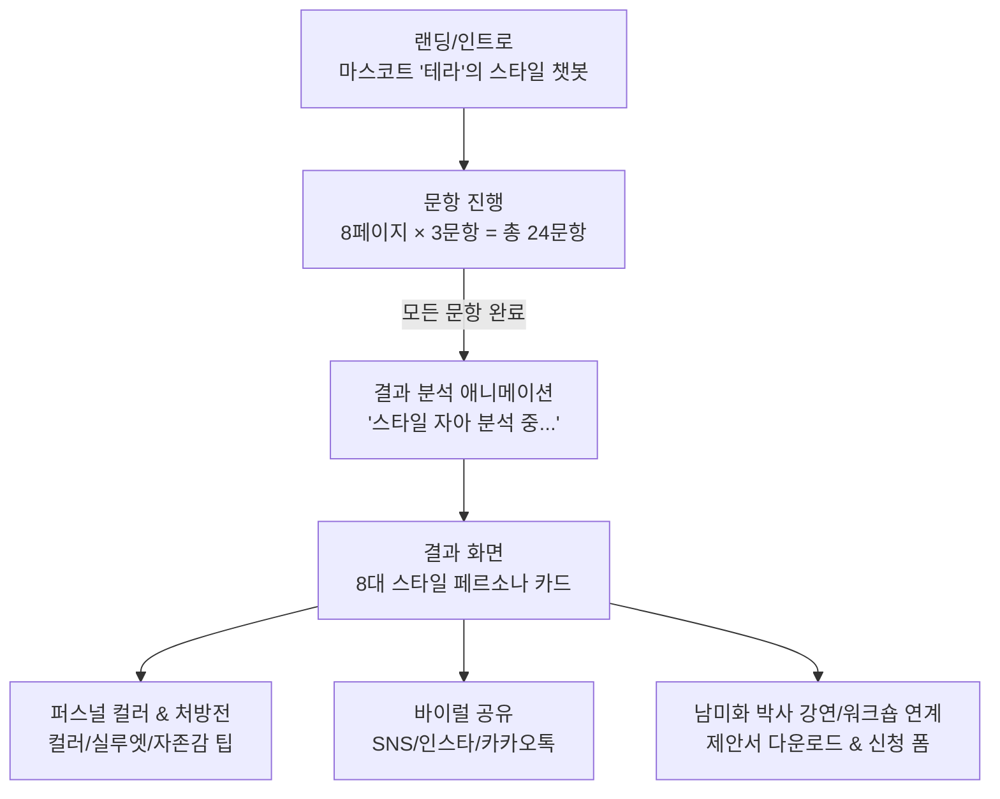

# 순수 패션테라피 심리테스트 앱 개발지시서 (Pure Fashion Therapy Edition)

- **문서 버전**: v1.0 (순수 패션테라피 단독 에디션)
- **작성일자**: 2026-08-22
- **총괄 자문**: 남미화 박사 (패션테라피 인문학 전문가 / 패션 심리치료 전문가)
- **발주처**: 패션테라피진흥원
- **서비스 가칭**: **"패션 테라피 이너 스타일러 (FASHION THERAPY INNER STYLER)"**

---

## 1. 기획 배경 및 차별화 컨셉

본 개발지시서는 사상체질(태양·태음·소양·소음인) 요소를 배제하고, **남미화 박사의 독자적인 '의복 심리학', '색채 심리(퍼스널 컬러 테라피)', '자아존중감 회복 스타일링'에 100% 집중한 순수 패션테라피 전용 웹 진단 서비스**를 구축하기 위한 명세서입니다.

### 🌟 핵심 철학: "옷은 나를 표현하는 가장 강력한 심리적 처방전이다"
- **문제 의식**: 많은 현대인들이 유행과 타인의 시선에 쫓겨 자신에게 맞지 않는 옷을 입거나, 우울·불안·자존감 저하 상태에서 칙칙한 무채색 옷 뒤로 자신을 숨깁니다.
- **해결 솔루션**: 3분 간의 간결한 심리·의복 선호도 테스트를 통해 **내면의 감정 상태와 고유한 스타일 자아(Style Ego)**를 발견하고, 즉각적으로 기분을 고양시키는 **컬러·소재·실루엣 힐링 솔루션**을 처방합니다.

---

## 2. 순수 패션테라피 4대 진단 축 (Psychological Dimensions)

사상체질 대신 심리학적 의복 행동 모델을 기반으로 4개 차원의 점수를 도출합니다:

1. **색채 에너지 축 (Color Vitality)**:
   - `Vivid Energy` (원색/고채도, 생동감, 외향적 표출) vs `Calm Neutral` (뉴트럴/파스텔, 평온함, 내면의 쉼)
2. **스타일 표현성 축 (Style Expression)**:
   - `Bold Avant-garde` (독창적 개성, 혁신, 트렌드 리딩) vs `Classic Timeless` (정갈함, 신뢰감, 미니멀)
3. **의복 심리 동기 축 (Dressing Motivation)**:
   - `Social Empathy` (대인관계 조화, 따뜻한 연결) vs `Autonomous Identity` (자기만족, 독립적 주체성)
4. **자존감 회복 탄력성 축 (Self-Esteem Resilience)**:
   - `Mood Booster` (옷을 통한 기분 전환 및 도약) vs `Inner Anchor` (안정적 자아 지지대)

---

## 3. 순수 패션테라피 8대 스타일 자아 유형 (8 Style Personas)

| 유형 ID | 유형 명칭 | 핵심 페르소나 카피 | 추천 힐링 컬러 | 추천 스타일링 처방 |
| :--- | :--- | :--- | :--- | :--- |
| `TYPE-01` | **비비드 크리에이터** | "자유로운 영감과 유쾌한 에너지를 입는 예술가" | 코랄 레드, 탠저린 오렌지 | 비대칭 컷팅, 볼드한 컬러 포인트 |
| `TYPE-02` | **클래식 큐레이터** | "단아한 품격과 확고한 신뢰를 전하는 완벽주의자" | 로열 네이비, 딥 버건디 | 테일러드 자켓, 정갈한 실루엣 |
| `TYPE-03` | **내추럴 힐러** | "자연의 편안한 숨결로 주변을 위로하는 평화주의자" | 올리브 그린, 웜 오트밀 | 린넨/코튼 소재, 루즈핏 니트 |
| `TYPE-04` | **파워 드레서** | "당당한 존재감으로 시선을 사로잡는 오피니언 리더" | 매트 블랙, 에메랄드 그린 | 직선적 숄더, 모던 수트 셋업 |
| `TYPE-05` | **소프트 로맨틱** | "따뜻한 공감과 섬세한 다정함을 건네는 사랑주의자" | 베이비 핑크, 라벤더 퍼플 | 부드러운 드레이프, 실크 스카프 |
| `TYPE-06` | **모던 미니멀리스트** | "불필요한 군더더기를 덜어내고 본질에 집중하는 철학자" | 챠콜 그레이, 클린 화이트 | 미니멀 원피스, 톤온톤 매칭 |
| `TYPE-07` | **트렌드 파이오니어** | "새로운 변화와 감각적인 시도를 즐기는 인플루언서" | 일렉트릭 블루, 네온 라임 | 레이어드 룩, 유니크 액세서리 |
| `TYPE-08` | **어반 아카이비스트** | "시간이 흘러도 변치 않는 깊이감을 사랑하는 지성인" | 앤틱 브라운, 세이지 그린 | 빈티지 체크, 클래식 트렌치코트 |

---

## 4. 정보구조 (IA) & 화면 흐름



---

## 5. 데이터 스키마 및 채점 구조

### `questions.json` (24문항 구성)
```json
{
  "totalSteps": 8,
  "questionsPerPage": 3,
  "pages": [
    {
      "step": 1,
      "category": "색채 심리",
      "items": [
        { "id": "q01", "text": "선명하고 화려한 색상을 입으면 하루의 기분이 즉시 고양된다.", "dimension": "vitality", "weight": { "yes": 1, "no": -1 } },
        { "id": "q02", "text": "옷을 고를 때 타인의 평가보다 내 감정적 편안함이 최우선이다.", "dimension": "motivation", "weight": { "yes": 1, "no": -1 } },
        { "id": "q03", "text": "베이직한 기본 아이템보다 디테일이 독특한 옷에 먼저 눈이 간다.", "dimension": "expression", "weight": { "yes": 1, "no": -1 } }
      ]
    }
  ]
}
```

---

## 6. 개발 체크리스트

- [ ] **Data**: `questions.json` (24문항) 및 `types.json` (8종 유형) 정적 데이터 구축
- [ ] **UI/UX**: 감성적인 에디토리얼 무드의 모바일 퍼스트 인터랙티브 UI 개발
- [ ] **Algorithm**: 4개 차원 누적 가중치 합산 및 8대 페르소나 매핑 엔진 구현
- [ ] **Lead Capture**: 남미화 박사의 지자체/도서관/기업 특강 신청 Google 스프레드시트 연동
- [ ] **Deployment**: GitHub Pages 배포 및 실기기 터치 제스처 검증
